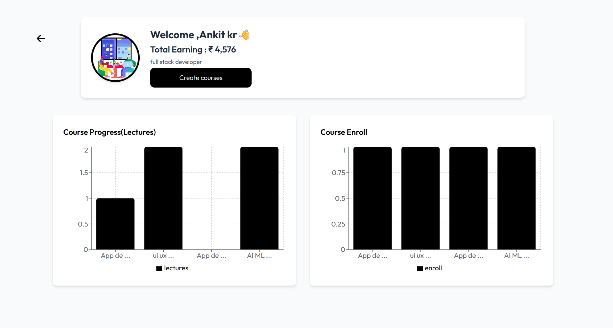
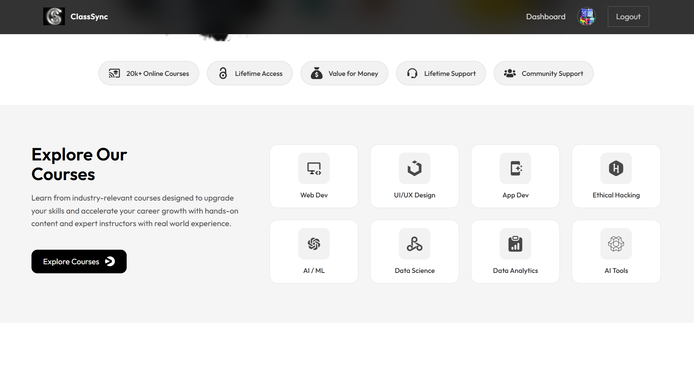

# ClassSync LMS 🎓

> **Empowering Education Through Technology**  
> A comprehensive Learning Management System (LMS) designed to bridge the gap between instructors and students with seamless course management, secure payments, and interactive learning tools.


[](https://class-sync-y2ru.onrender.com/)


## 📖 Project Overview

ClassSync is a robust, full-stack LMS platform that facilitates modern e-learning. It provides a unified interface for students to enroll in courses, track progress, and interact with content, while enabling instructors to manage curriculum, assessments, and student data efficiently. Built with scalability and user experience in mind, it leverages the latest web technologies to deliver a fast, secure, and engaging educational environment.

## ✨ Key Features

*   **🔐 Secure Authentication**: Robust user registration and login using JWT and HttpOnly cookies.
*   **📚 Course Management**: Comprehensive tools for instructors to create, update, and manage course content.
*   **💳 Integrated Payments**: Seamless checkout experience for course enrollment via Razorpay.
*   **☁️ Cloud Storage**: Efficient media handling for course videos and resources using Cloudinary.
*   **📧 Automated Notifications**: Email alerts for registration, password resets, and course updates via Nodemailer.
*   **💬 Interactive Reviews**: Student feedback system to rate and review courses.
*   **🎨 AI-Powered Insights**: (Upcoming) Google GenAI integration for personalized learning recommendations.
*   **📱 Responsive Design**: Fully optimized interface for learning on desktop, tablet, and mobile devices.

## 🛠️ Tech Stack

### Frontend
*   **Framework**: React (Vite)
*   **State Management**: Redux Toolkit
*   **Styling**: Tailwind CSS
*   **Routing**: React Router DOM
*   **HTTP Client**: Axios
*   **UI Components**: React Icons, React Toastify, Recharts

### Backend
*   **Runtime**: Node.js
*   **Framework**: Express.js
*   **Database**: MongoDB (Mongoose)
*   **Authentication**: JWT, BcryptJS
*   **Middleware**: Cookie-Parser, Multer, CDM (Cross-Origin Resource Sharing)

### DevOps & Tools
*   **Version Control**: Git
*   **Linting**: ESLint
*   **Deployment**: Render (Backend), Vercel/Netlify (Frontend - *Recommended*)

## 🏗️ System Architecture

The application follows a **Client-Server Architecture** with a RESTful API:

1.  **Client (Frontend)**: Handles user interaction, rendering UI components, and managing application state. It communicates with the backend via secure API calls.
2.  **Server (Backend)**: Processes requests, executes business logic, interacts with the database, and handles third-party integrations (Razorpay, Cloudinary, Nodemailer).
3.  **Database**: MongoDB stores user profiles, course data, enrollments, and reviews.

**High-Level Flow:**
`User Request` ➡️ `React Frontend` ➡️ `Express API` ➡️ `Controller Logic` ➡️ `database/Third-Party Service` ➡️ `Response`

## 🚀 Installation & Setup

Follow these steps to set up the project locally.

### Prerequisites
*   Node.js (v14 or higher)
*   MongoDB (Local or Atlas URI)
*   Git

### 1. Clone the Repository
```bash
git clone https://github.com/your-username/class-sync-lms.git
cd class-sync-lms
```

### 2. Backend Setup
Navigate to the backend directory and install dependencies:
```bash
cd backend
npm install
```

Create a `.env` file in the `backend` directory (see [Environment Variables](#-environment-variables)).

Start the backend server:
```bash
npm run dev
```

### 3. Frontend Setup
Open a new terminal navigate to the frontend directory:
```bash
cd frontend
npm install
```

Start the development server:
```bash
npm run dev
```

The application should now be running at `http://localhost:5173` (Frontend) and `http://localhost:8000` (Backend).

## 🔑 Environment Variables

Create a `.env` file in the `backend` folder and add the following configuration:

```env
# Server Configuration
PORT=8000
MOGODB_URL=mongodb+srv://<username>:<password>@cluster.mongodb.net/lms_db

# Security
JWT_SECRET=your_super_secret_jwt_key

# Cloudinary (File Uploads)
CLOUDINARY_NAME=your_cloud_name
CLOUDINARY_API_KEY=your_api_key
CLOUDINARY_API_SECRET=your_api_secret

# Nodemailer (Email Service)
USER_EMAIL=your_email@gmail.com
USER_PASSWORD=your_email_app_password

# Razorpay (Payments)
RAZORPAY_KEY_ID=your_razorpay_key_id
RAZORPAY_KEY_SECRET=your_razorpay_key_secret
```

## 📡 API Overview

| Module | Base Route | Description |
| :--- | :--- | :--- |
| **Auth** | `/api/auth` | User registration, login, logout, password reset |
| **User** | `/api/user` | Profile management, role updates |
| **Course** | `/api/course` | Create, read, update, delete courses |
| **Payment** | `/api/order` | Process payments and verify transactions |
| **Review** | `/api/review` | Add and retrieve course reviews |

## 📸 Screenshots

<!-- Add your screenshots here -->

| Dashboard | Course View |
| :---: | :---: |
|  |  |

## 🔮 Future Enhancements

*   [ ] **Live Classes**: Integration with Zoom or WebRTC for real-time sessions.
*   [ ] **Gamification**: Badges and leaderboards to increase student engagement.
*   [ ] **Mobile App**: Native mobile application using React Native.
*   [ ] **Advanced Analytics**: Detailed reporting dashboards for instructors.

## 🤝 Contributing

Contributions are welcome! Please fork the repository and submit a pull request for any enhancements or bug fixes.

1.  Fork the Project
2.  Create your Feature Branch (`git checkout -b feature/AmazingFeature`)
3.  Commit your Changes (`git commit -m 'Add some AmazingFeature'`)
4.  Push to the Branch (`git push origin feature/AmazingFeature`)
5.  Open a Pull Request

## 📄 License

This project is licensed under the ISC License.
